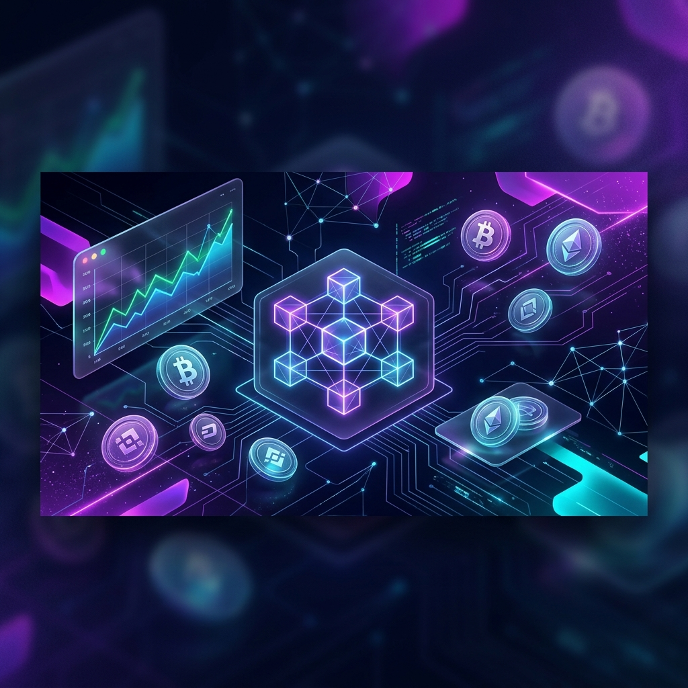
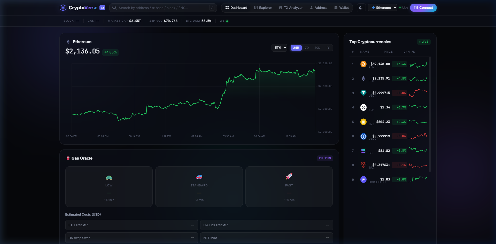

<p align="center">
  
</p>

<h1 align="center">◆ CryptoVerse</h1>

<p align="center">
  <b>A Full-Stack Web3 Portfolio Project & Real-Time Blockchain Dashboard</b><br>
  <i>✨ Built with Solidity · Hardhat · Manta Pacific · Node.js · Ethers.js ✨</i>
</p>

<p align="center">
  
  
  
  
  
  
  
</p>

---

<p align="center">
  
</p>

---

## 🚀 Overview

**CryptoVerse** is a production-grade, full-stack **Web3 Portfolio Project** designed to demonstrate advanced blockchain engineering capabilities. It bridges the gap between Web2 dashboard analytics and true Web3 interactivity by integrating **custom Solidity smart contracts**, on-chain write interactions, and seamless support for **EVM-compatible environments like Manta Pacific L2**.

It features a robust Hardhat development environment for Solidity, a Node.js backend powering 15+ REST API endpoints, a live WebSocket server for real-time synchronization, and a premium frontend interface designed for direct Web3 wallet (MetaMask) interactions.

This project demonstrates comprehensive Web3 and blockchain engineering skills, including:

- **Solidity Smart Contract Development:** Custom ERC-20 token, fully on-chain generative ERC-721 NFT, and a DeFi Staking Vault (written from scratch to demonstrate low-level EVM knowledge).
- **Manta Network Integration:** Configured to deploy to and interact with the Manta Pacific L2 ecosystem.
- **On-Chain Web3 Interactions:** MetaMask integration for deploying contracts, minting NFTs, and staking funds directly from the frontend.
- **Server-Side Blockchain Interaction:** Complex transaction decoding, block streaming, and gas estimation via Ethers.js multi-chain providers.

---

## ✨ Features

### 💎 Smart Contracts (Solidity + Hardhat)

| Contract | Features | Description |
|---|---|---|
| **CryptoVerseToken** | `ERC-20` | Custom implementation with mint, burn, pause, and access control mechanics. |
| **CryptoVerseNFT** | `ERC-721` | Fully on-chain generative SVG art and metadata based on blockchain entropy. |
| **CryptoVerseVault** | `DeFi` | Staking vault with time-locked deposits, tiered reward distribution, and reentrancy protection. |

### 🔗 Backend (Node.js + Express)

| Feature | Description |
|---|---|
| **Multi-Chain Support** | Ethereum, **Manta Pacific L2**, Polygon, BSC with automatic RPC failover |
| **Transaction Decoder** | Parses ERC-20 transfers, Uniswap swaps, NFT operations from raw calldata |
| **Address Analyzer** | Detects EOA vs Smart Contract, reads bytecode size, resolves ENS |
| **Token Scanner** | Checks popular ERC-20 token balances for any address |
| **Gas Oracle** | EIP-1559 aware gas pricing with USD cost estimates |
| **WebSocket Server** | Live streaming of blocks, gas updates, and whale alerts |

### 🎨 Frontend (Vanilla JS SPA)

| Page | Description |
|---|---|
| **📊 Dashboard** | Interactive price chart, top 10 coins, gas oracle, live block feed |
| **🔍 Explorer** | Browse latest blocks with drill-down to individual block transactions |
| **🔬 TX Analyzer** | Paste any transaction hash → decoded method calls, args, event logs |
| **🔎 Inspector** | Inspect any Ethereum address for balance, type, ENS, and ER20 tokens |
| **📜 Contracts** | Deploy contracts, mint tokens/NFTs, stake in vaults, view Solidity source code |
| **💼 Wallet** | Connect MetaMask to view balances, network info, and token holdings |

### 🎯 Design

- Premium dark/light theme with glassmorphism and animated gradient orbs
- Responsive layout (desktop → mobile)
- Skeleton loaders, micro-animations, and smooth page transitions
- Keyboard shortcuts (press `/` to focus search)
- Toast notification system

---

## 📁 Project Structure

```
CryptoVerse/
├── contracts/             # Solidity Smart Contracts
│   ├── CryptoVerseToken.sol   (Custom ERC-20)
│   ├── CryptoVerseNFT.sol     (On-chain Generative Art)
│   └── CryptoVerseVault.sol   (DeFi Staking Vault)
├── hardhat.config.js      # Hardhat config with Manta Pacific settings
├── server.js              # Node.js backend (Express + WebSocket + Ethers.js)
├── package.json           # Dependencies and scripts
├── .env                   # Environment variables (gitignored)
├── .env.example           # Configuration template
├── .gitignore             # Git ignore rules
├── start.bat              # One-click Windows launcher
├── banner.png             # README banner
├── screenshot.png         # Dashboard screenshot
│
└── public/                # Static frontend (served by Express)
    ├── index.html         # Single-page application HTML
    ├── css/
    │   └── style.css      # Full design system (~700 lines)
    └── js/
        └── app.js         # Client-side application (~650 lines)
```

---

## ⚡ Quick Start

### Option 1: One-Click (Windows)

Simply double-click **`start.bat`** — it will:
1. Check Node.js is installed
2. Auto-install dependencies if missing
3. Create `.env` from template if needed
4. Start the server and open your browser

### Option 2: Manual

```bash
# 1. Clone the repo
git clone https://github.com/mustadafinshimanto/CryptoVerse.git
cd cryptoverse

# 2. Install dependencies
npm install

# 3. Configure environment (optional but recommended)
cp .env.example .env
# Edit .env and add your RPC API key

# 4. Start the server
npm start

# 5. Open in browser
# http://localhost:3000
```

---

## ⚙️ Configuration

Copy `.env.example` to `.env` and customize:

```env
# Server port
PORT=3000

# Ethereum RPC (get free keys from infura.io or alchemy.com)
# Using a private RPC key dramatically improves reliability
ETH_RPC_URL=https://mainnet.infura.io/v3/YOUR_KEY_HERE
POLYGON_RPC_URL=
BSC_RPC_URL=

# CoinGecko API key (optional, free tier works without)
COINGECKO_API_KEY=

# Minimum ETH value to trigger whale alerts
WHALE_THRESHOLD=10
```

> **💡 Tip:** Sign up for a free [Infura](https://infura.io/) or [Alchemy](https://www.alchemy.com/) account to get a private RPC URL. This eliminates rate-limiting from public endpoints and unlocks full functionality.

---

## 📡 API Reference

### Network

| Method | Endpoint | Description |
|---|---|---|
| `GET` | `/api/stats` | Block number, gas price, chain info |
| `GET` | `/api/chains` | List available chains |
| `POST` | `/api/chain` | Switch active chain |

### Blocks

| Method | Endpoint | Description |
|---|---|---|
| `GET` | `/api/blocks?count=10` | Latest N blocks |
| `GET` | `/api/block/:id` | Full block with transactions |

### Transactions

| Method | Endpoint | Description |
|---|---|---|
| `GET` | `/api/tx/:hash` | Decode and analyze transaction |

### Addresses

| Method | Endpoint | Description |
|---|---|---|
| `GET` | `/api/address/:addr` | Balance, type, ENS, nonce |
| `GET` | `/api/tokens/:addr` | Scan ERC-20 token balances |

### ENS

| Method | Endpoint | Description |
|---|---|---|
| `GET` | `/api/ens/resolve/:name` | ENS name → address |
| `GET` | `/api/ens/lookup/:addr` | Address → ENS name |

### Gas

| Method | Endpoint | Description |
|---|---|---|
| `GET` | `/api/gas` | Gas tiers, USD cost estimates |

### Market Data

| Method | Endpoint | Description |
|---|---|---|
| `GET` | `/api/market/global` | Total market cap, volume, BTC dominance |
| `GET` | `/api/market/coins?count=10` | Top coins with sparklines |
| `GET` | `/api/market/chart/:coinId?days=7` | Price history |
| `GET` | `/api/market/coin/:coinId` | Coin details |

### Search

| Method | Endpoint | Description |
|---|---|---|
| `GET` | `/api/search/:query` | Universal search (address, tx, block, ENS) |

### WebSocket (`ws://localhost:3000/ws`)

| Event | Payload | Description |
|---|---|---|
| `welcome` | `{ chain, message }` | Connection confirmed |
| `newBlock` | `{ number, hash, miner, transactionCount }` | New block mined |
| `whaleAlert` | `{ hash, from, to, value, symbol }` | Large transfer detected |
| `gasUpdate` | `{ gasPrice, baseFee }` | Gas price changed |

---

## 🛠️ Tech Stack

| Layer | Technology | Purpose |
|---|---|---|
| **Runtime** | Node.js | Server-side JavaScript |
| **Server** | Express.js | REST API framework |
| **Blockchain** | Ethers.js v6 | Multi-chain Ethereum interaction |
| **Real-time** | ws (WebSocket) | Live data streaming |
| **Cache** | Custom in-memory | TTL-based request caching |
| **Market Data** | CoinGecko API | Crypto prices and charts |
| **Charts** | Chart.js | Price visualization |
| **Wallet** | MetaMask / Web3 | Browser wallet integration |
| **Security** | dotenv | Environment variable management |
| **Styling** | Vanilla CSS | Custom glassmorphism design system |

---

## 🔒 Security

- API keys and RPC URLs stored in `.env` (gitignored)
- Server-side proxying prevents API key exposure to the frontend
- Input validation on all API endpoints
- Rate-limit-friendly caching reduces RPC calls

---

## 🎵 Vibe Coding

This project was **vibe coded** — built through creative collaboration with AI, turning high-level ideas and vibes into production-grade blockchain code. Instead of writing every line manually, the development process focused on:

- 🧠 **Ideation & Architecture** — Conceptualizing features and system design
- 🎨 **Design Direction** — Guiding the visual aesthetic and user experience
- ⚡ **Rapid Iteration** — Real-time feedback loops to shape the product
- 🔗 **Blockchain Integration** — Combining AI speed with Web3 domain expertise

Vibe coding represents a new paradigm in software development — where developers focus on **what** to build and **why**, while AI handles the **how**. The result? A full-stack blockchain dashboard built at 10x speed without sacrificing quality.

---

## 📄 License

This project is licensed under the **MIT License** — see the [LICENSE](LICENSE) file for details.

---

<p align="center">
  <b>🎵 Vibe Coded with ❤️ by <a href="https://github.com/mustadafinshimanto">Mustad Afin Shimanto</a></b><br>
  <i>Powered by AI · Built with Node.js · Express · Ethers.js · WebSocket · Chart.js</i>
</p>
